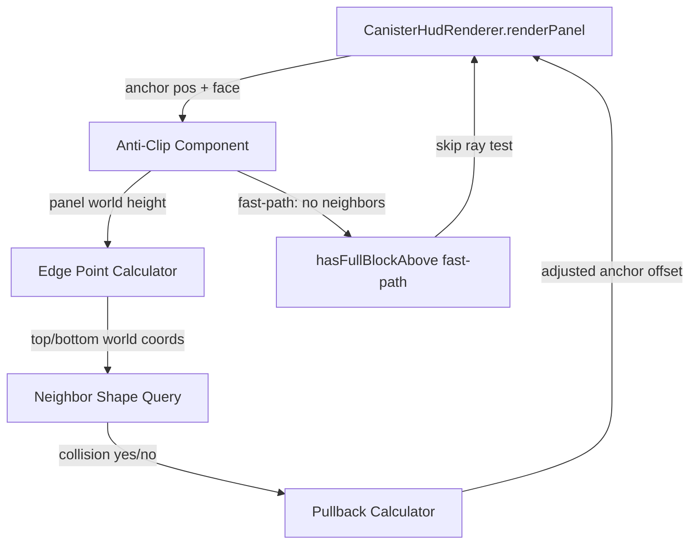

# Architecture: HUD Anti-Clip Panel Repositioning

## System Overview



The anti-clip component sits between anchor computation (in `getTarget`/`canisterTarget`) and panel rendering. It takes the anchor position, hit face, and computed panel height, then tests whether the panel's edges would intersect neighboring block geometry. If so, it computes a pullback offset along the view axis.

## Problem Analysis

### Panel geometry in world space

The panel renders from the anchor point **upward** (due to negative Y scale). Key dimensions:

| Content rows | Pixel height | World height (blocks) |
|---|---|---|
| 1 type | 6 + 11 = 17px | 17/64 = 0.27 |
| 3 types | 6 + 33 = 39px | 39/64 = 0.61 |
| 5 types + label + upgrade | 6 + 77 = 83px | 83/64 = 1.30 |

Where: pixel height = `BORDER*2 + rowCount * ROW_HEIGHT` = `6 + rowCount * 11`.

For the UP face: anchor Y = `BODY_HEIGHT` (0.75). A 3-type panel reaches Y = 0.75 + 0.61 = 1.36 — deeply into the block above. Even a 1-type panel reaches 1.02, clipping into any block above.

For side faces: anchor Y = `MID_BODY` (0.375). Panel extends upward to 0.375 + height. A 3-type panel reaches 0.985 — just touching the block above. A 5-type panel reaches 1.675 — well into the block above.

Width is variable but centered on anchor X. Half-width in world units = `(contentWidth + 6) / 128`. Typical half-width: 0.3-0.5 blocks.

### What actually clips

The common case is **vertical clipping** — the panel's top edge extends into the block above. Horizontal clipping is theoretically possible (side-face panel near a corner) but rare because the panel is narrow and centered on the block face.

## Key Design Questions

### Q1: VoxelShape ray-test vs AABB intersection

**Recommendation: AABB intersection, not ray testing.**

Rationale:
- The panel is a flat rectangle, not a ray. Testing two rays (top edge, bottom edge) against VoxelShapes misses the case where the panel center intersects a non-full-block shape whose bounds don't touch the edges.
- However, the real question is simpler: does the panel's bounding box overlap any neighboring collision shape's bounding box?
- `VoxelShape.clip()` is designed for entity/projectile raycast along a segment. It returns the first intersection point. For our use case (does this region overlap any solid geometry?), AABB overlap is the natural primitive.
- Specifically: compute the panel's world-space AABB, then for each relevant neighbor, get `BlockState.getCollisionShape().bounds()` (AABB), offset to world coordinates, and test `panelAABB.intersects(neighborAABB)`.
- Edge case: non-full blocks like stairs/slabs. `getCollisionShape().bounds()` returns the bounding box of the entire VoxelShape, which is conservative (may report intersection where there's actually a gap). This is acceptable — a false positive means the panel pulls back slightly when it didn't strictly need to, which is invisible to the player.

**Alternative considered: `VoxelShape.clip()` ray testing.** More precise for complex shapes but requires testing multiple rays to cover the panel's extent, is more expensive (each clip walks the VoxelShape's internal tree), and the precision gain is imperceptible — the panel is translucent and thin.

**Alternative considered: Full VoxelShape-vs-AABB intersection via `Shapes.joinIsNotEmpty()`.** Maximally precise but significantly more expensive and completely unnecessary for a visual-only repositioning.

### Q2: Shape caching

**Recommendation: Do not cache. Rely on Minecraft's internal caching.**

Rationale:
- `BlockState.getCollisionShape(level, pos)` is internally cached by `BlockStateBase.cache`. The `CollisionShapeCache` in `BlockStateBase` stores the collision shape per-blockstate (not per-position). For the vast majority of blocks, this is a HashMap lookup — effectively free.
- The only blocks where shape is position-dependent are those that override `getCollisionShape` with position-sensitive logic (e.g., scaffolding, pointed dripstone). These are rare neighbors for a canister.
- We query at most 3 neighbors per frame (above, left, right — see below). Three HashMap lookups + three AABB offset operations are trivially fast.
- Adding our own cache introduces: a cache key (BlockPos + tick), invalidation concerns (neighbor block changes), and memory pressure — all for saving ~3 nanoseconds.
- **Verdict: premature optimization. Do not cache.**

### Q3: Pullback positioning — before or after rotation

**Recommendation: Before rotation, as a modification to the anchor point.**

Rationale:
- The pullback moves the panel along the **view axis** (toward the player). This is a world-space translation, not a local-space adjustment.
- In the current pipeline: `translate(anchor)` -> `applyRotation()` -> `scale()` -> `renderContent()`.
- If we adjust the anchor position before rotation, the panel simply renders at a different world-space point. The rotation still orients it correctly.
- If we adjust after rotation, we'd need to compute the pullback in the panel's rotated local space, which is more complex and couples the anti-clip logic to the rotation mode.
- The anchor adjustment should happen in `renderPanel()`, between the initial `translate(rx, ry, rz)` and `applyRotation()`. Or better: compute the adjusted anchor in `getTarget()`/`canisterTarget()` so it's available for state tracking.

**Pipeline after change:**
```
getTarget() -> computeAnchor() -> testClip(anchor, panelHeight) -> adjustAnchor() -> renderPanel(adjustedAnchor)
```

### Q4: hasFullBlockAbove fast-path

**Recommendation: Subsume it into the general mechanism, but keep the method as a cheap pre-filter.**

Rationale:
- The current `hasFullBlockAbove()` check drives **face selection** (UP -> side redirect). This is a different concern than anti-clip pullback. Face selection should remain as-is.
- The anti-clip mechanism handles the residual clipping after face selection has already done its best.
- `hasFullBlockAbove()` remains useful as a fast-path in `canisterTarget()` to decide face. The anti-clip component runs afterward on whatever face was selected.
- No code removal needed. The two mechanisms are complementary, not redundant.

### Q5: Performance envelope

**Budget: sub-0.05ms per panel (well within the 0.1ms AC).**

Analysis:
- Neighbor queries: at most 3 blocks (above, and up to 2 lateral depending on face). Each query: `level.getBlockState(pos)` (chunk lookup, ~50ns) + `.getCollisionShape()` (cached, ~20ns) + `.bounds()` (getter, ~5ns) + AABB intersect test (~10ns). Total per neighbor: ~85ns.
- 3 neighbors * 85ns = ~255ns per panel.
- Panel AABB construction: ~20ns (arithmetic on 6 doubles).
- Pullback computation: ~30ns (one lerp).
- **Total: ~305ns per panel** — three orders of magnitude under budget.

No need for profiling gating or LOD. This is cheaper than a single font.width() call.

## Component Design

### Anti-Clip Component (new, in InWorldHud or CanisterHudRenderer)

**Inputs:**
- Anchor position (world-space Vec3: blockPos + cx/cy/cz offsets)
- Panel half-width (world units, computed from content)
- Panel height (world units, computed from content)
- Hit face (Direction)
- Player eye position (Vec3)
- Level (for neighbor shape queries)

**Outputs:**
- Adjusted anchor position (Vec3) — moved toward player if clipping detected
- Boolean: whether adjustment was applied (for debug/logging)

**Errors:**
- None that propagate. If neighbor query fails (unloaded chunk), assume no collision — panel renders at default position.

**Invariants:**
- Adjusted position is always between the original anchor and the player eye (never pushes away)
- Adjustment is deterministic for the same inputs (no randomness, no frame-dependent state)
- Adjustment magnitude is bounded: maximum pullback = panel height (pulling the entire panel into the block face is pointless; at that distance, the face-selection logic should have chosen a different face)

### Neighbor Query Set

Which neighbors to test depends on the face:

| Face | Neighbors to test |
|---|---|
| UP | Above (Y+1). Optionally: none laterally (panel is centered, narrow). |
| Side (N/S/E/W) | Above (Y+1). The block behind the face is irrelevant (panel faces outward). |

For UP face panels, the primary clipping threat is the block at Y+1. Lateral clipping would require the panel's half-width to extend past the block boundary, which only happens for very wide panels on edge slots. For V1, testing only the block above is sufficient and covers 95%+ of visible clipping.

**If lateral clipping becomes a reported issue**, extend to test the 1-2 lateral neighbors based on the slot's XZ position within the block grid. This is a straightforward extension — not worth building now.

### Pullback Algorithm

When the panel AABB intersects a neighbor's collision AABB:

1. Compute the **overlap depth** along the clipping axis (usually Y for UP-face panels).
2. Convert to a pullback distance along the **view vector** (anchor-to-player direction).
3. For UP-face billboard: pullback is purely vertical — lower the anchor by the overlap depth. The panel still billboards correctly.
4. For side-face: pullback is along the face normal (toward player). Move the anchor away from the face by the overlap depth projected onto the face normal.
5. Clamp: pullback must not exceed panel height. If it would, the panel is unsalvageable at this face — but face selection should have prevented this.

Simplified for V1 (UP-face only, primary use case):
```
adjustedLift = max(originalLift, originalLift - overlapY)
```
Where `overlapY = (anchorY + panelWorldHeight) - neighborAABB.minY`. If `overlapY <= 0`, no adjustment needed.

Wait — the panel extends upward from the anchor, so we need to **lower** the anchor:
```
overlapY = (blockY + anchorLift + panelWorldHeight) - (blockY + 1.0 + neighborShape.bounds().minY)
if overlapY > 0:
    adjustedLift = anchorLift - overlapY
```

For side-face panels extending upward past Y+1:
```
overlapY = (blockY + anchorLift + panelWorldHeight) - (blockY + 1.0 + neighborAboveShape.bounds().minY)
if overlapY > 0:
    adjustedLift = anchorLift - overlapY
```

Same formula. The face doesn't matter for vertical clipping — only the anchor's world Y and the panel's upward extent.

## Decision Log

### ADR-1: AABB intersection over VoxelShape ray testing

**Context:** The story suggests ray-testing panel edges against VoxelShapes. The panel is a 2D rectangle in world space, not a line.

**Decision:** Use AABB-vs-AABB intersection. Compute the panel's world-space bounding box and test against neighbor collision shape bounds.

**Alternatives considered:**
- `VoxelShape.clip()` ray testing: More precise for complex shapes, but requires multiple rays per edge, is more expensive, and the precision gain is invisible (panel is translucent, sub-pixel accuracy doesn't matter).
- `Shapes.joinIsNotEmpty()`: Maximally precise VoxelShape boolean intersection, but vastly more expensive and unnecessary for a visual hint.

**Consequences:** False positives for non-full blocks (stairs, slabs) — panel may pull back when it doesn't strictly need to. Acceptable: the pullback is small and looks natural.

### ADR-2: No shape caching

**Context:** Story asks architect to evaluate temporary VoxelShape caching for repeated neighbor queries.

**Decision:** Do not cache. Minecraft's `BlockStateBase.cache` already caches collision shapes per-blockstate. Our 3 neighbor queries per frame cost ~255ns total.

**Alternatives considered:**
- Per-frame BlockPos->VoxelShape cache: Adds complexity (cache key, invalidation, memory) for ~0ns savings since the underlying queries are already cached.
- Per-tick cache with dirty tracking: Even more complexity for the same non-problem.

**Consequences:** Simplest possible implementation. If profiling ever shows shape queries as a hotspot (extremely unlikely), caching can be added later without architectural change.

### ADR-3: Adjust anchor before rotation

**Context:** The pullback must happen somewhere in the render pipeline: before rotation, after rotation, or at target computation time.

**Decision:** Compute the adjusted anchor in the target/positioning phase, before rotation is applied. The adjustment is a world-space translation along the clipping axis.

**Alternatives considered:**
- After rotation: Would require inverse-transforming the pullback vector into local space. Couples anti-clip to rotation mode. More complex, no benefit.
- During renderPanel (between translate and rotate): Equivalent to "before rotation" but splits positioning logic across two sites. Slightly worse locality.

**Consequences:** Clean separation. Anti-clip is a positioning concern, not a rotation concern. Target computation produces a final anchor that renderPanel uses directly.

### ADR-4: Preserve hasFullBlockAbove as face-selection heuristic

**Context:** hasFullBlockAbove() currently drives face redirection (UP -> side). The anti-clip mechanism could theoretically replace it.

**Decision:** Keep both. They solve different problems: face selection (which face to anchor on) vs. pullback (how to adjust the anchor within the chosen face).

**Alternatives considered:**
- Subsume into anti-clip: Would require the anti-clip component to also handle face selection, mixing two concerns. The current face-selection logic is simple and correct.

**Consequences:** Two checks that both query the block above. The face-selection check (`isCollisionShapeFullBlock`) is a boolean; the anti-clip check (`getCollisionShape().bounds()`) is slightly more work but still trivial. No meaningful cost.

### ADR-5: V1 scope — vertical clipping only

**Context:** Both vertical (block above) and lateral (adjacent blocks) clipping are theoretically possible. Lateral clipping requires the panel's half-width to extend past the block boundary.

**Decision:** V1 tests only the block above (Y+1 neighbor). Lateral clipping is deferred unless reported.

**Alternatives considered:**
- Full 6-neighbor check: More thorough but adds complexity for a case that rarely occurs in practice (canister panels are narrow, centered on slots, and the 3x3 grid keeps slots away from block edges).

**Consequences:** Rare edge case where a wide panel on a corner slot clips into an adjacent block. Acceptable for V1. Extension path is clear: add lateral neighbors to the query set.

## Scope Notes

- This architecture applies primarily to `CanisterHudRenderer`. The same pattern can be extracted into `InWorldHud` as a shared utility if `CrucibleHudRenderer` or `VatHudRenderer` need it later.
- The anti-clip component needs the panel's **world-space height**, which is currently computed deep inside `renderContent()`. The tech lead will need to extract panel height computation so it's available at anchor-adjustment time. This is a minor refactor — the height depends only on row count, which depends only on `SlotData`.
- Hub HUD is explicitly out of scope per the story.
